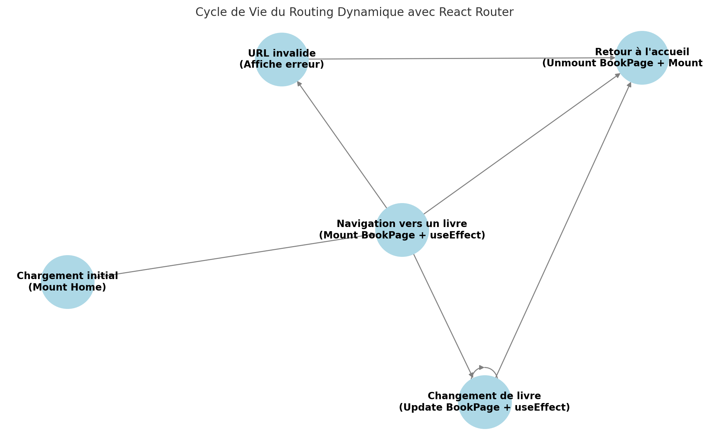

🔄 Cycle de vie de notre application
Voici chaque étape du cycle de vie, avec ce qui se passe exactement à chaque moment.

📌 1. Chargement initial de l’application
Fichiers concernés :

App.jsx
Navbar.jsx
Home.jsx
About.jsx
Documentation.jsx
💡 Que se passe-t-il quand on ouvre http://localhost:5173/ ?

1 . React charge App.jsx et affiche Navbar.jsx et Home.jsx (route /).
2 . Le navigateur affiche la page Home.
3 . La liste des livres est affichée dans la Navbar grâce à .map().
4 . Tout ce qui est dans useState s'initialise.
5 . Aucun useEffect ne se déclenche encore, car rien n’a changé.

📌 Cycle de vie React (pour Home.jsx)

Étape	             |   Explication
===========================================================================================
Montage (Mount)	     |   App.jsx charge Home.jsx avec <Route path="/" element={<Home />} />
Rendu (Render)	     |   React affiche les éléments JSX dans le navigateur
Aucun useEffect	     |   Car nous n'avons pas d'effet à exécuter ici

📌 2. L'utilisateur clique sur un livre dans la Navbar

💡 Exemple : Il clique sur "La peau de chagrin" (/book/la-peau-de-chagrin).
1. React Router met à jour l'URL (/book/la-peau-de-chagrin).
2. La route dynamique BookPage est chargée (<Route path="/book/:bookId" element={<BookPage />} />).
3. React exécute useParams() et récupère bookId = "la-peau-de-chagrin".
4. useEffect est déclenché car bookId a changé.
5. useEffect exécute setSelectedBook() et met à jour l'état.
6. React re-render BookPage avec les nouvelles infos du livre.

📌 Cycle de vie React (pour BookPage.jsx)

Étape	                   | Explication
==================================================================================================
Montage (Mount)	           | BookPage est affiché car l'URL a changé
Rendu (Render)	           | Affichage du JSX, mais selectedBook est encore undefined
Exécution du useEffect	   | useEffect récupère bookId, cherche le livre, et met à jour selectedBook
Re-render	               | React met à jour l'affichage pour montrer les détails du livre

📌 3. L'utilisateur clique sur un autre livre

💡 Exemple : Il passe de "La peau de chagrin" à "Pars vite et reviens tard".
1. L'URL change (/book/pars-vite-et-reviens-tard).
2. React Router détecte ce changement et recharge BookPage.
3. useParams() met à jour bookId.
4. useEffect est déclenché car bookId a changé.
5. useEffect cherche le nouveau livre et met à jour selectedBook.
6. React re-render BookPage avec le nouveau livre.

📌 Cycle de vie React (pour BookPage.jsx lors du changement de livre)

Étape	                |    Explication
============================================================================================================
Mise à jour (Update)	|    bookId change → React garde BookPage actif mais met à jour useParams()
Exécution du useEffect	|    Recherche du livre correspondant à bookId et mise à jour de selectedBook
Re-render	            |    Affichage des nouvelles infos du livre

📌 4. L'utilisateur tape une URL invalide

💡 Exemple : Il tape /book/inconnu dans la barre d’URL.
1. React Router charge BookPage.
2. useParams() récupère bookId = "inconnu".
3. useEffect cherche un livre avec ce slug, mais ne trouve rien.
4. selectedBook reste undefined.
5. React affiche le message ❌ Ce livre n'existe pas.

📌 Cycle de vie React (pour BookPage.jsx quand le livre n’existe pas)

Étape	                  |      Explication
====================================================================================
Montage (Mount)	          |    BookPage est chargé avec bookId = "inconnu"
Exécution du useEffect	  |    Recherche du livre, mais find() ne retourne rien
Rendu conditionnel	      |    React affiche ❌ Ce livre n'existe pas.

📌 5. L'utilisateur revient à l'accueil

💡 Il clique sur "Accueil" dans la Navbar (/).
1. React Router met à jour l'URL (/).
2. La route <Route path="/" element={<Home />} /> est chargée.
3. React démonte (unmount) BookPage car il n'est plus affiché.
4. React affiche Home.jsx.

📌 Cycle de vie React (lorsqu'on quitte BookPage.jsx)

Étape	                        |              Explication
==================================================================================================================
Démontage (Unmount)	            |    BookPage disparaît de l'écran
Nettoyage éventuel	            |    Si on avait utilisé un useEffect avec return () => {...}, il s'exécuterait ici
Affichage de la nouvelle page   |    Home.jsx prend la place

🎯 Résumé final
1. Étape	Action	Cycle de vie déclenché
2. Chargement initial	Ouverture de http://localhost:5173/	Mount de Home.jsx
3. Navigation vers un livre	L’utilisateur clique sur un lien dans la Navbar	Mount de BookPage.jsx + useEffect déclenché
4. Changement de livre	L’utilisateur clique sur un autre livre	Update de BookPage.jsx + useEffect relancé
5. URL invalide	L’utilisateur tape une URL qui n’existe pas	Mount de BookPage.jsx + affichage du message d’erreur
6. Retour à l’accueil	L’utilisateur clique sur "Accueil"	Unmount de BookPage.jsx + Mount de Home.jsx

Voici le schéma du cycle de vie de notre routing dynamique avec React Router ! 🔥

📌 Lecture du schéma :

1. Chargement initial → L'application démarre avec la page d'accueil (Home).
2. Navigation vers un livre → Un livre est sélectionné (BookPage se monte + useEffect s'exécute).
3. Changement de livre → L'utilisateur choisit un autre livre (useEffect est relancé).
4. URL invalide → L'utilisateur entre une URL inconnue (BookPage affiche une erreur).
5. Retour à l'accueil → L'utilisateur revient sur Home (BookPage est démonté, Home est monté).

## 🔄 Cycle de vie de notre application

Voici chaque étape du cycle de vie, avec ce qui se passe exactement à chaque moment.

### 📌 1. Chargement initial de l’application

**Fichiers concernés :**
- App.jsx
- Navbar.jsx
- Home.jsx
- About.jsx
- Documentation.jsx

**💡 Que se passe-t-il quand on ouvre http://localhost:5173/ ?**
- React charge `App.jsx` et affiche `Navbar.jsx` et `Home.jsx` (route `/`).
- Le navigateur affiche la page Home.
- La liste des livres est affichée dans la Navbar grâce à `.map()`.
- Tout ce qui est dans `useState` s'initialise.
- Aucun `useEffect` ne se déclenche encore, car rien n’a changé.

### 📌 Cycle de vie React (pour Home.jsx)

| Étape | Explication |
|---|---|
| Montage (Mount) | `App.jsx` charge `Home.jsx` avec `<Route path="/" element={<Home />} />` |
| Rendu (Render) | React affiche les éléments JSX dans le navigateur |
| Aucun `useEffect` | Car nous n'avons pas d'effet à exécuter ici |

### 📌 2. L'utilisateur clique sur un livre dans la Navbar

**💡 Exemple :** Il clique sur *"La peau de chagrin"* (`/book/la-peau-de-chagrin`).

- React Router met à jour l'URL (`/book/la-peau-de-chagrin`).
- La route dynamique `BookPage` est chargée (`<Route path="/book/:bookId" element={<BookPage />} />`).
- React exécute `useParams()` et récupère `bookId = "la-peau-de-chagrin"`.
- `useEffect` est déclenché car `bookId` a changé.
- `useEffect` exécute `setSelectedBook()` et met à jour l'état.
- React re-render `BookPage` avec les nouvelles infos du livre.

### 📌 Cycle de vie React (pour BookPage.jsx)

| Étape | Explication |
|---|---|
| Montage (Mount) | `BookPage` est affiché car l'URL a changé |
| Rendu (Render) | Affichage du JSX, mais `selectedBook` est encore `undefined` |
| Exécution du `useEffect` | `useEffect` récupère `bookId`, cherche le livre, et met à jour `selectedBook` |
| Re-render | React met à jour l'affichage pour montrer les détails du livre |

### 📌 3. L'utilisateur clique sur un autre livre

**💡 Exemple :** Il passe de *"La peau de chagrin"* à *"Pars vite et reviens tard"*.

- L'URL change (`/book/pars-vite-et-reviens-tard`).
- React Router détecte ce changement et recharge `BookPage`.
- `useParams()` met à jour `bookId`.
- `useEffect` est déclenché car `bookId` a changé.
- `useEffect` cherche le nouveau livre et met à jour `selectedBook`.
- React re-render `BookPage` avec le nouveau livre.

### 📌 Cycle de vie React (pour BookPage.jsx lors du changement de livre)

| Étape | Explication |
|---|---|
| Mise à jour (Update) | `bookId` change → React garde `BookPage` actif mais met à jour `useParams()` |
| Exécution du `useEffect` | Recherche du livre correspondant à `bookId` et mise à jour de `selectedBook` |
| Re-render | Affichage des nouvelles infos du livre |

### 📌 4. L'utilisateur tape une URL invalide

**💡 Exemple :** Il tape `/book/inconnu` dans la barre d’URL.

- React Router charge `BookPage`.
- `useParams()` récupère `bookId = "inconnu"`.
- `useEffect` cherche un livre avec ce slug, mais ne trouve rien.
- `selectedBook` reste `undefined`.
- React affiche le message ❌ *Ce livre n'existe pas*.

### 📌 Cycle de vie React (pour BookPage.jsx quand le livre n’existe pas)

| Étape | Explication |
|---|---|
| Montage (Mount) | `BookPage` est chargé avec `bookId = "inconnu"` |
| Exécution du `useEffect` | Recherche du livre, mais `find()` ne retourne rien |
| Rendu conditionnel | React affiche ❌ *Ce livre n'existe pas.* |

### 📌 5. L'utilisateur revient à l'accueil

**💡 Il clique sur "Accueil" dans la Navbar (`/`).**

- React Router met à jour l'URL (`/`).
- La route `<Route path="/" element={<Home />} />` est chargée.
- React démonte (`unmount`) `BookPage` car il n'est plus affiché.
- React affiche `Home.jsx`.

### 📌 Cycle de vie React (lorsqu'on quitte BookPage.jsx)

| Étape | Explication |
|---|---|
| Démontage (Unmount) | `BookPage` disparaît de l'écran |
| Nettoyage éventuel | Si on avait utilisé un `useEffect` avec `return () => {...}`, il s'exécuterait ici |
| Affichage de la nouvelle page | `Home.jsx` prend la place |

---

## 🎯 Résumé final

| Étape | Action | Cycle de vie déclenché |
|---|---|---|
| Chargement initial | Ouverture de `http://localhost:5173/` | Mount de `Home.jsx` |
| Navigation vers un livre | L’utilisateur clique sur un lien dans la Navbar | Mount de `BookPage.jsx` + `useEffect` déclenché |
| Changement de livre | L’utilisateur clique sur un autre livre | Update de `BookPage.jsx` + `useEffect` relancé |
| URL invalide | L’utilisateur tape une URL qui n’existe pas | Mount de `BookPage.jsx` + affichage du message d’erreur |
| Retour à l’accueil | L’utilisateur clique sur "Accueil" | Unmount de `BookPage.jsx` + Mount de `Home.jsx` |

---

## 🔥 Cycle De Vie Du Routing Dynamique Avec React Router

Voici le schéma du cycle de vie de notre routing dynamique avec React Router !

📌 **Lecture du schéma :**
- **Chargement initial** → L'application démarre avec la page d'accueil (`Home`).
- **Navigation vers un livre** → Un livre est sélectionné (`BookPage` se monte + `useEffect` s'exécute).
- **Changement de livre** → L'utilisateur choisit un autre livre (`useEffect` est relancé).
- **URL invalide** → L'utilisateur entre une URL inconnue (`BookPage` affiche une erreur).
- **Retour à l'accueil** → L'utilisateur revient sur `Home` (`BookPage` est démonté, `Home` est monté).

